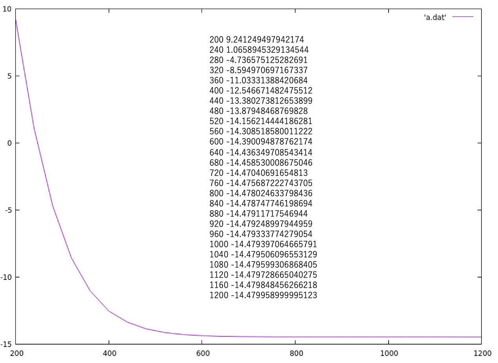
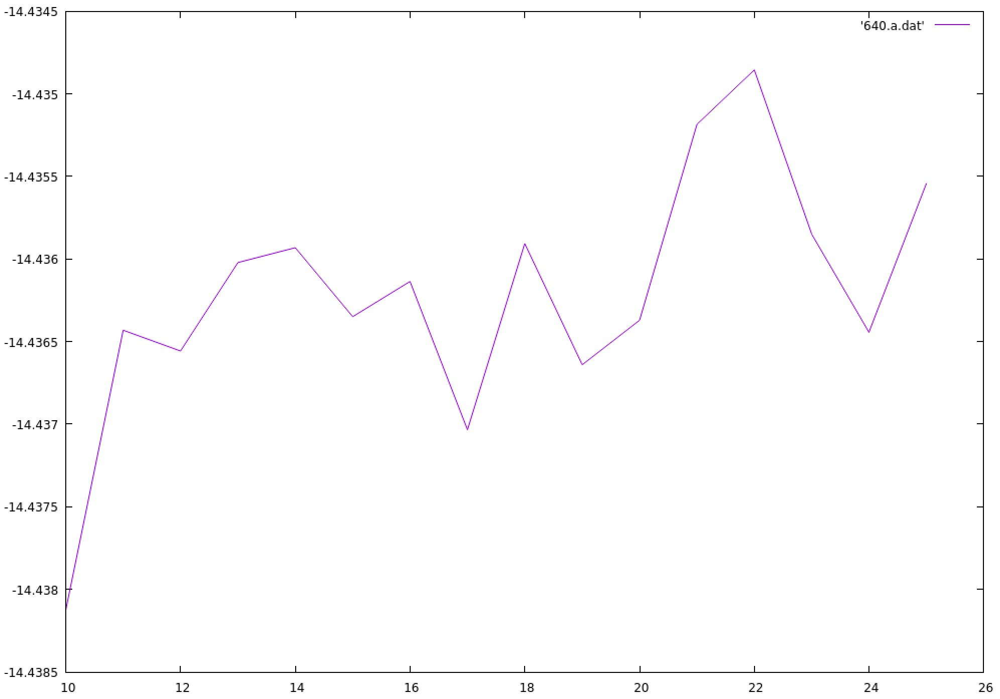
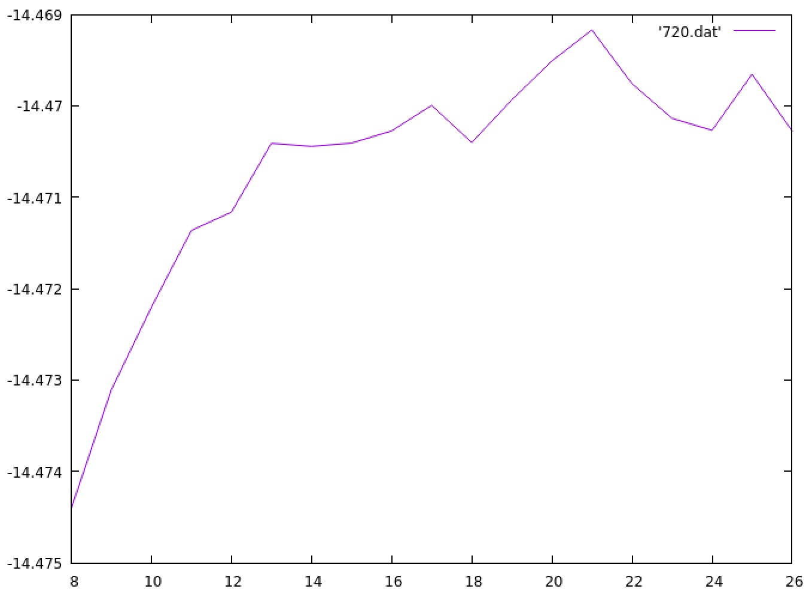

# 水分子の全エネルギー収束について

まずカットオフエネルギーについて収束を求めます。

```
import numpy as np
from ase.parallel import paropen
from gpaw import GPAW, PW, FermiDirac, Davidson
from ase.build import molecule

with paropen('a.dat', 'w') as fd:
    for ecut in range(200, 1201, 40):
        a = 15
        h2o = molecule('H2O')
        h2o.set_cell((a, a, a))
        h2o.center()
        calc = GPAW(mode=PW(ecut),
                    nbands=10,
                    kpts={'gamma':True},
                    xc='PBE',
                    occupations=FermiDirac(0.0, fixmagmom=True),
                    eigensolver='rmm-diis',
                    convergence={'energy': 2.0e-11},
                    txt=f'h2o-{ecut}.txt')
        h2o.calc = calc
        e = h2o.get_potential_energy()
        calc.write(f'h2o-{ecut}.gpw')

        print(ecut, e, file=fd)
```

このスクリプトを利用し、それぞれのecutにおけるエネルギーをプロットした図が以下になります。
縦軸、横軸共に[/eV]です。



<br />

平面波の数は`Number of coefficients`で合ってますでしょうか。
ecutそれぞれの出力から得られた結果は以下になります。

```
h2o-0200.txt:  Number of coefficients: 21823 (reduced to 10912)
h2o-0240.txt:  Number of coefficients: 28425 (reduced to 14213)
h2o-0280.txt:  Number of coefficients: 35825 (reduced to 17913)
h2o-0320.txt:  Number of coefficients: 43819 (reduced to 21910)
h2o-0360.txt:  Number of coefficients: 52299 (reduced to 26150)
h2o-0400.txt:  Number of coefficients: 61445 (reduced to 30723)
h2o-0440.txt:  Number of coefficients: 70751 (reduced to 35376)
h2o-0480.txt:  Number of coefficients: 80725 (reduced to 40363)
h2o-0520.txt:  Number of coefficients: 90879 (reduced to 45440)
h2o-0560.txt:  Number of coefficients: 101505 (reduced to 50753)
h2o-0600.txt:  Number of coefficients: 112451 (reduced to 56226)
h2o-0640.txt:  Number of coefficients: 124097 (reduced to 62049)
h2o-0680.txt:  Number of coefficients: 135883 (reduced to 67942)
h2o-0720.txt:  Number of coefficients: 148381 (reduced to 74191)
h2o-0760.txt:  Number of coefficients: 160467 (reduced to 80234)
h2o-0800.txt:  Number of coefficients: 173541 (reduced to 86771)
h2o-0840.txt:  Number of coefficients: 186623 (reduced to 93312)
h2o-0880.txt:  Number of coefficients: 200237 (reduced to 100119)
h2o-0920.txt:  Number of coefficients: 213583 (reduced to 106792)
h2o-0960.txt:  Number of coefficients: 228007 (reduced to 114004)
h2o-1000.txt:  Number of coefficients: 242361 (reduced to 121181)
h2o-1040.txt:  Number of coefficients: 257031 (reduced to 128516)
h2o-1080.txt:  Number of coefficients: 271985 (reduced to 135993)
h2o-1120.txt:  Number of coefficients: 287369 (reduced to 143685)
h2o-1160.txt:  Number of coefficients: 302659 (reduced to 151330)
h2o-1200.txt:  Number of coefficients: 318721 (reduced to 159361)
```

<br />

---

この結果よりセルのサイズはカットオフを640eV, 720eVにして、サイズごとにエネルギーを求めました。

先ほどのスクリプトをセルサイズについてのループに変えて実行し、プロットした図が以下になります。
横軸がセルサイズ、縦軸がエネルギーです。


カットオフエネルギー640eVで計算した結果

<br />


カットオフエネルギー720eVで計算した結果

<br />

720eVで計算した際の`Number of coefficients`は以下のようになっています。
セルサイズ(26, 26, 26)の時点で計算が走らなくなりました。

```
h2o-08.txt:  Number of coefficients: 22575 (reduced to 11288)
h2o-09.txt:  Number of coefficients: 31919 (reduced to 15960)
h2o-10.txt:  Number of coefficients: 43819 (reduced to 21910)
h2o-11.txt:  Number of coefficients: 58269 (reduced to 29135)
h2o-12.txt:  Number of coefficients: 75925 (reduced to 37963)
h2o-13.txt:  Number of coefficients: 96177 (reduced to 48089)
h2o-14.txt:  Number of coefficients: 120473 (reduced to 60237)
h2o-15.txt:  Number of coefficients: 148381 (reduced to 74191)
h2o-16.txt:  Number of coefficients: 179579 (reduced to 89790)
h2o-17.txt:  Number of coefficients: 215503 (reduced to 107752)
h2o-18.txt:  Number of coefficients: 256119 (reduced to 128060)
h2o-19.txt:  Number of coefficients: 300739 (reduced to 150370)
h2o-20.txt:  Number of coefficients: 351195 (reduced to 175598)
h2o-21.txt:  Number of coefficients: 406295 (reduced to 203148)
h2o-22.txt:  Number of coefficients: 467041 (reduced to 233521)
h2o-23.txt:  Number of coefficients: 533945 (reduced to 266973)
h2o-24.txt:  Number of coefficients: 607141 (reduced to 303571)
h2o-25.txt:  Number of coefficients: 685365 (reduced to 342683)
h2o-26.txt:  Number of coefficients: 771113 (reduced to 385557)
```

